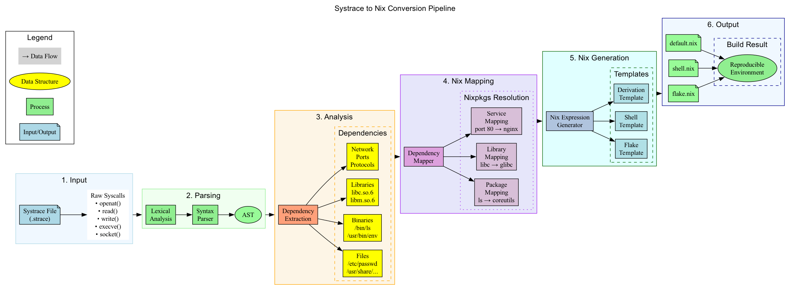
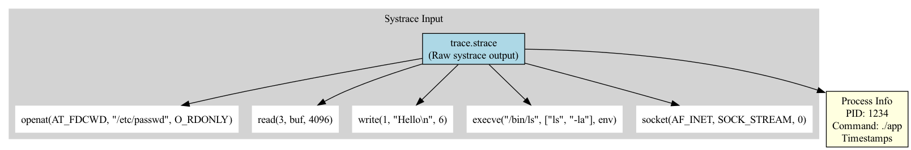
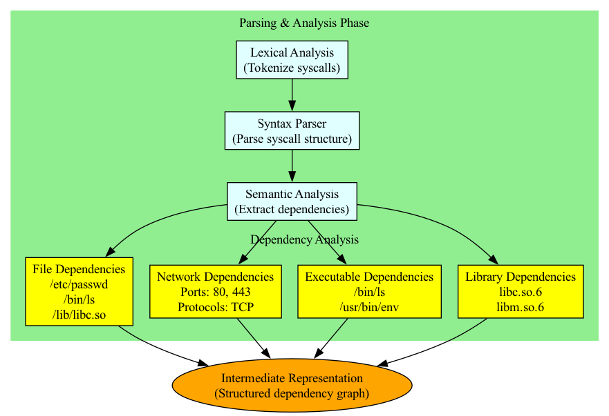
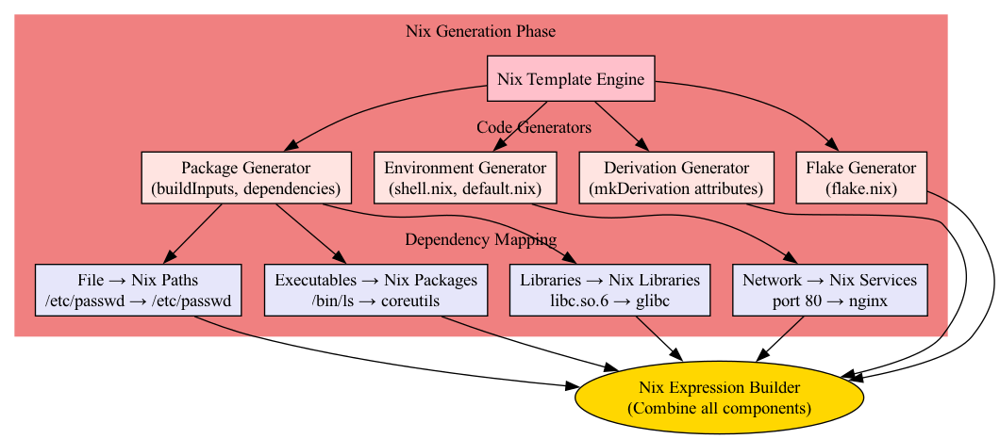
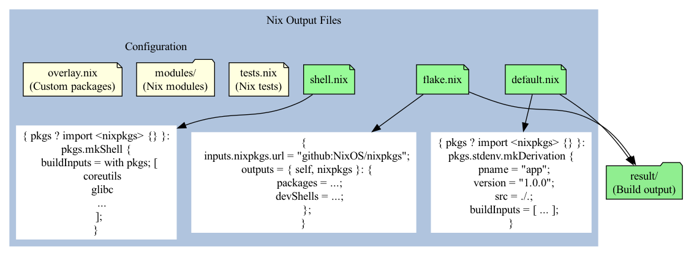

# Systrace to Nix Conversion: Technical Architecture

## Overview

This document provides a detailed technical explanation of the systrace to Nix conversion pipeline, which automatically generates reproducible Nix environments from system call traces. The conversion process analyzes runtime behavior captured by `strace` and transforms it into declarative Nix expressions that precisely specify all dependencies.



## Table of Contents

1. [Input Phase: Systrace Capture](#1-input-phase-systrace-capture)
2. [Parsing & Analysis Phase](#2-parsing--analysis-phase)
3. [Nix Generation Phase](#3-nix-generation-phase)
4. [Output Phase: Nix Expressions](#4-output-phase-nix-expressions)
5. [Implementation Details](#5-implementation-details)
6. [Optimization Strategies](#6-optimization-strategies)
7. [Edge Cases & Limitations](#7-edge-cases--limitations)

## 1. Input Phase: Systrace Capture



### System Call Tracing

The conversion begins with capturing system calls using `strace`. The trace file contains raw syscall data that reveals the application's runtime behavior:

```bash
strace -f -e trace=file,process,network -o trace.strace ./application
```

### Key Syscalls Analyzed

The converter focuses on several categories of system calls:

#### File Operations
- `openat(AT_FDCWD, path, flags)` - File access patterns
- `stat/lstat/fstat` - File metadata queries
- `read/write/pread/pwrite` - I/O operations
- `mmap/munmap` - Memory-mapped files

#### Process Management
- `execve(path, argv, envp)` - Program execution
- `fork/vfork/clone` - Process creation
- `dlopen/dlsym` - Dynamic library loading

#### Network Operations
- `socket(domain, type, protocol)` - Network socket creation
- `connect/bind/listen` - Network connections
- `sendto/recvfrom` - Network I/O

### Metadata Extraction

Each syscall entry includes:
- **Timestamp**: Precise timing for ordering dependencies
- **PID/TID**: Process/thread identification for multi-process traces
- **Return Values**: Success/failure indicators
- **Arguments**: Full parameter details including paths, flags, and buffers

## 2. Parsing & Analysis Phase



### Lexical Analysis

The lexer tokenizes the raw strace output into structured tokens:

```python
class SyscallToken:
    timestamp: float
    pid: int
    name: str
    args: List[Argument]
    return_value: Union[int, str]
    errno: Optional[int]
```

### Syntax Parser

The parser constructs an Abstract Syntax Tree (AST) from tokens:

1. **Syscall Normalization**: Handles platform-specific variations
2. **Argument Parsing**: Extracts structured data from string arguments
3. **Path Resolution**: Resolves relative paths to absolute
4. **Symbol Resolution**: Maps file descriptors to actual files

### Semantic Analysis

The semantic analyzer extracts high-level dependencies:

#### Dependency Graph Construction

```python
class DependencyNode:
    path: str
    access_type: Set[AccessType]  # READ, WRITE, EXECUTE
    first_access: float
    last_access: float
    accessing_pids: Set[int]
```

#### File Dependencies
- **Configuration Files**: `/etc/*`, `~/.config/*`
- **Data Files**: Application-specific data paths
- **Temporary Files**: `/tmp/*`, `/var/tmp/*`
- **System Files**: `/proc/*`, `/sys/*`, `/dev/*`

#### Library Dependencies
Dynamic library resolution through:
1. Direct `dlopen()` calls
2. ELF interpreter loads (`/lib/ld-linux.so`)
3. `LD_LIBRARY_PATH` resolution
4. RPATH/RUNPATH analysis

#### Network Dependencies
- **Ports**: Both listening and connecting ports
- **Protocols**: TCP, UDP, Unix domain sockets
- **Addresses**: IP addresses, hostnames (via DNS resolution tracking)

### Intermediate Representation

The IR is a directed acyclic graph (DAG) where:
- **Nodes**: Resources (files, libraries, network endpoints)
- **Edges**: Dependencies with metadata (access type, frequency)
- **Weights**: Importance scores based on access patterns

## 3. Nix Generation Phase



### Dependency Mapping

The mapper translates system dependencies to Nix packages:

#### Package Resolution Algorithm

```python
def resolve_package(binary_path: str) -> Optional[NixPackage]:
    # 1. Check direct mapping database
    if binary_path in KNOWN_BINARIES:
        return KNOWN_BINARIES[binary_path]
    
    # 2. Query nixpkgs index
    result = query_nixpkgs_index(binary_path)
    if result:
        return result
    
    # 3. Heuristic matching
    package_name = extract_package_name(binary_path)
    candidates = search_nixpkgs(package_name)
    return best_match(candidates, binary_path)
```

#### Library Mapping

Libraries are mapped through a multi-stage process:

1. **SONAME Extraction**: Extract library SONAME from ELF headers
2. **Version Matching**: Match specific library versions
3. **Package Discovery**: Find Nix packages providing the library
4. **Dependency Resolution**: Recursively resolve library dependencies

#### Service Mapping

Network services are mapped based on:
- **Port Numbers**: Standard port → service mapping
- **Protocol Detection**: Protocol-specific service identification
- **Process Names**: Match process names to known services

### Template Engine

The template engine generates Nix expressions using specialized generators:

#### Package Generator

Produces `buildInputs` and `nativeBuildInputs`:

```nix
buildInputs = with pkgs; [
  # Runtime dependencies
  coreutils
  glibc
  openssl
  # ...
];

nativeBuildInputs = with pkgs; [
  # Build-time dependencies
  gcc
  cmake
  pkg-config
  # ...
];
```

#### Environment Generator

Creates development shell configurations:

```nix
pkgs.mkShell {
  buildInputs = dependencies;
  
  shellHook = ''
    export LD_LIBRARY_PATH=${pkgs.lib.makeLibraryPath libraries}
    export PATH=${pkgs.lib.makeBinPath binaries}:$PATH
  '';
  
  # Environment variables from trace
  ENV_VAR_1 = "value1";
  ENV_VAR_2 = "value2";
}
```

#### Derivation Generator

Builds complete package derivations:

```nix
stdenv.mkDerivation rec {
  pname = "application";
  version = "1.0.0";
  
  src = ./.;
  
  buildInputs = runtime_deps;
  nativeBuildInputs = build_deps;
  
  buildPhase = ''
    # Generated from traced build commands
  '';
  
  installPhase = ''
    # Generated from traced installation paths
  '';
}
```

#### Flake Generator

Creates modern Nix flakes with proper inputs and outputs:

```nix
{
  inputs = {
    nixpkgs.url = "github:NixOS/nixpkgs/nixos-unstable";
    flake-utils.url = "github:numtide/flake-utils";
  };
  
  outputs = { self, nixpkgs, flake-utils }:
    flake-utils.lib.eachDefaultSystem (system:
      let
        pkgs = nixpkgs.legacyPackages.${system};
      in {
        packages.default = derivation;
        devShells.default = shell;
        
        # NixOS module for service configuration
        nixosModules.default = nixos_module;
      });
}
```

## 4. Output Phase: Nix Expressions



### Generated Files

#### flake.nix
The main entry point for Nix Flakes, providing:
- Reproducible dependency locking via `flake.lock`
- Multiple output targets (packages, shells, modules)
- Cross-platform support specifications

#### shell.nix
Development environment specification:
- Interactive shell with all dependencies
- Development tools and debugging utilities
- Environment variable configuration
- Shell hooks for initialization

#### default.nix
Traditional Nix expression for compatibility:
- Backward compatibility with non-flake Nix
- Simple derivation for building the application
- Can be used with `nix-build`

#### overlay.nix
Custom package overrides:
```nix
self: super: {
  # Override specific packages
  application = super.application.overrideAttrs (old: {
    buildInputs = old.buildInputs ++ [ additional_deps ];
  });
}
```

### Build Artifacts

The `result/` symlink points to the build output containing:
- Compiled binaries
- Runtime dependencies
- Configuration files
- Documentation

## 5. Implementation Details

### Syscall Filtering

Not all syscalls are relevant for dependency detection:

```python
IGNORED_SYSCALLS = {
    'clock_gettime',  # Time queries
    'getpid',         # Process info
    'brk',            # Memory management
    'mprotect',       # Memory protection
    'futex',          # Synchronization
}

IMPORTANT_SYSCALLS = {
    'open', 'openat',     # File access
    'execve',             # Program execution
    'connect', 'bind',    # Network
    'dlopen',             # Dynamic loading
}
```

### Path Canonicalization

Paths are normalized to handle:
- Symbolic links resolution
- Relative path conversion
- Environment variable expansion
- Home directory expansion (`~`)

### Dependency Deduplication

The converter implements smart deduplication:

1. **Path-based deduplication**: Same file accessed multiple times
2. **Package-level deduplication**: Multiple files from same package
3. **Transitive dependency elimination**: Remove implied dependencies

### Version Pinning

Dependencies can be pinned to specific versions:

```nix
buildInputs = [
  (pkgs.python3.withPackages (ps: with ps; [
    (numpy.overridePythonAttrs (old: rec {
      version = "1.21.0";
      src = fetchPypi {
        inherit version;
        sha256 = "...";
      };
    }))
  ]))
];
```

## 6. Optimization Strategies

### Minimal Dependency Set

The converter employs several strategies to minimize dependencies:

1. **Access Frequency Analysis**: Prioritize frequently accessed files
2. **Critical Path Analysis**: Focus on dependencies in the main execution path
3. **Dead Code Elimination**: Remove dependencies only accessed in error paths

### Caching Mechanisms

Performance optimizations include:

- **Syscall cache**: Memoize parsed syscalls
- **Package resolution cache**: Cache Nixpkgs queries
- **Template cache**: Pre-compile frequently used templates

### Parallel Processing

The pipeline supports parallelization:

```python
with ProcessPoolExecutor() as executor:
    # Parallel syscall parsing
    parsed_syscalls = executor.map(parse_syscall, raw_syscalls)
    
    # Parallel dependency resolution
    resolved_deps = executor.map(resolve_dependency, dependencies)
```

## 7. Edge Cases & Limitations

### Dynamic Loading

Challenges with runtime dynamic loading:
- **Plugin Systems**: Dependencies loaded based on configuration
- **JIT Compilation**: Runtime-generated code
- **Interpreted Languages**: Dependencies in scripts

### Network Services

Limitations in network dependency detection:
- **DNS Resolution**: May miss dynamic DNS queries
- **Protocol Detection**: Encrypted traffic analysis
- **Service Discovery**: mDNS, service mesh discovery

### Container Boundaries

Special handling for containerized applications:
- **Namespace Isolation**: Different view of filesystem
- **Mount Points**: Dynamic mounts during execution
- **cgroups**: Resource limitation effects

### Mitigation Strategies

1. **Multiple Trace Runs**: Capture different execution paths
2. **Manual Annotations**: Allow user-specified dependencies
3. **Fallback Mechanisms**: Conservative dependency inclusion
4. **Verification Phase**: Test generated environment

## Conclusion

The systrace to Nix conversion pipeline provides an automated approach to creating reproducible environments from runtime behavior. By analyzing system calls, the converter captures the complete dependency graph of an application and generates appropriate Nix expressions that ensure reproducibility across different systems.

The modular architecture allows for extensions and customizations at each phase, making it adaptable to various use cases from simple applications to complex distributed systems.